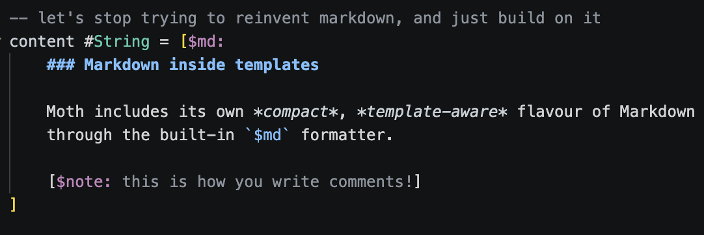

<div align="center">


<br>

# Moth

<p><em>
  A language for creating reliable software in elegant codebases
</em></p>

<p>⚠️ This project is in early Alpha ⚠️</p>
<p>⚠️ Better diagnostics, backend stability and more optimisation will come in time ⚠️</p> 

<p><a href="https://nyejames.github.io/moth/">The documentation site</a> was created using this language and toolchain. </p>

</div>
<br>
<br>

<div align="center">

## What is Moth?

</div>

Moth is a small, statically typed and opinionated programming language. 

The goal is to provide everything you need for modern, memory safe apps. Designed from the ground up to work elegantly within one language and build system.

Web development is the current focus. The home-grown HTML project builder creates static web pages using core compiler tooling.

</br>

Have a look at the [language docs](https://nyejames.github.io/moth/docs/) to get to grip with the basics.

<div align="center">

</br>

## Moth  🤝  Markdown

</div>

Templates are first-class language values in Moth.
They are the main way you create strings, but are far more powerful than regular string formatters. 



Moth's custom flavor of Markdown can live inside normal templates, so content can capture values, compose styles and fold straight into HTML at compile time.

This makes content-heavy pages quick to build and easy to format. 

No more TypeScript framework lasagne, build-tool linguini or 17 package dependency spaghetti for padding a string.

<br>
<div align="center">

## Getting Started

</div>

`moth` is the project tool for creating, checking, building and running Moth projects.
It's the CLI bundled with the compiler and build system.

Installation scripts will arrive for Beta, with tagged releases starting soon. For now you'll have to build from source.

### Create a project

```bash
moth new html my-site
cd my-site
```

### Run the development server

```bash
moth dev .
```

The dev server hot-reloads the project when files change automatically.

### Release build

```bash
moth build . --release
```

This compiles the project using the command-selected builder and writes output to the configured release directory.

<br>

<div align="center">
</div>

<div align="center">

## Goals 

</div>

- First-class string templates powerful enough to act as a small compile-time markup engine. They support built-in Markdown, formatting, slots and reactive runtime output.

- Readable and consistent syntax. Unique but quick to learn.

- Fast, modular tooling for short feedback loops and quick development builds (currently needs a lot more optimisation work).

- Built-in hot reloading development server.

- A small static type system plus borrow validation for memory-safe code that's free of data races and iterator invalidation by default.

- **Safe automatic memory management**, proven statically rather than by a collector. Compiler checks prevent invalid memory use, and backends with full memory control produce release builds with no tracing garbage collector at all — without any lifetime annotations, reference types or move syntax in your code.

- A backend-neutral frontend. Wasm as the main, platform-agnostic workhorse output target (Wasm backend in development).

- **As few dependencies as possible**. A language project shouldn't need a PhD dissertation for a lockfile.

<br>

See [the design principles doc](./docs/src/docs/design-scope/design-principles.mtf) for what the language is deliberately *not* doing.

<div align="center">

<br>

## LLM-aware design

</div>

Coding agents are increasingly becoming a part of coding workflows. 

Moth is designed for developers focused on the final design and implementation requirements while agents handle the busy work.

This isn't a language for LLMs only, its a language for human creativity with the churn automated away as much as possible.

See [HUMANS.md](./HUMANS.md) for more info and way too much elaboration about this.

<div align="center">

<br>
  
## Documentation

</div>
<strong>
<li>
    <ul>
        <a href="https://nyejames.github.io/moth/docs/">The language</a>
    </ul>
</li>
<br>
<li>
    <ul>
        <a href="./docs/compiler-design-overview.md">Compiler design</a>
    </ul>
</li>
<br>
<li>
    <ul>
        <a href="./docs/build-system-design.md">Build-system design</a>
    </ul>
</li>
<br>
<li>
    <ul>
        <a href="https://nyejames.github.io/moth/docs/codebase/memory-management/">Memory management</a>
    </ul>
</li>
<br>
</strong>

<div align="center">

## Tools

</div>

<a href="https://github.com/nyejames/moth-vscode-highlighting">Syntax highlighting for Visual Studio Code</a>

(LSP and more tooling to come in the future as the language stabilises)

<div align="center">
<br>

## Development Progress

</div>

Here is the current <a href="https://nyejames.github.io/moth/docs/progress/">progress matrix</a>.

The compiler already has broad frontend, backend and build-system tooling in place.

The language semantics and implementation is still shifting around as the final design is settled on.

<br>
